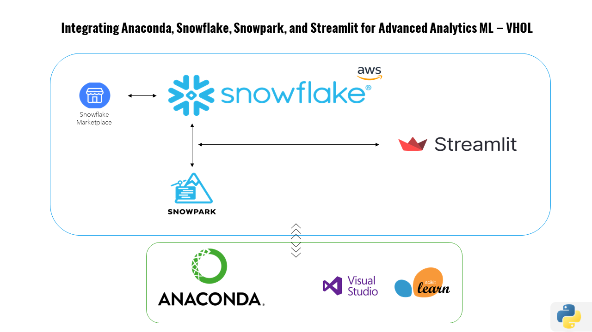

# Anaconda-Snowflake Integration for Data Analytics

This repository contains the customized code and documentation for setting up and integrating Anaconda, Snowflake, Snowpark, and Streamlit to create advanced data applications based on the Official Snowflake Quickstart performed by the hand of [Rafa Caballero](https://www.linkedin.com/in/ACoAABK28s4B8jxVi6edODzQinn3lf42S9tUuHk?lipi=urn%3Ali%3Apage%3Ad_flagship3_detail_base%3Be%2BHr71yPRYSU7sUUm8IRCQ%3D%3D)

## Overview

The codebase includes a detailed example of how to leverage Anaconda for environment management, connect to Snowflake's Data Warehouse, utilize Snowpark for data processing, and create interactive data visualizations with Streamlit.

## Custom Setup

- `connection_parameters`: Configurations for connecting to Snowflake with specifics for the EU-West-3 region on AWS.
- `snow_df_pce`: Modified table reference to align with the unique dataset naming conventions.

## Usage

Please refer to the [QUICKSTART-Building a data application with Snowflake Marketplace, Snowpark and Streamlit](https://quickstarts.snowflake.com/guide/data_apps_summit_lab/#0) for a step-by-step walkthrough of the lab experience and implementation details.

## Acknowledgments

- Thanks to Rafa from Snowflake for the lab guidance.
- Special mention to Snowflake for enabling such seamless data operations.

## Contact

If you have any questions or comments about the repo, please submit an issue here.
